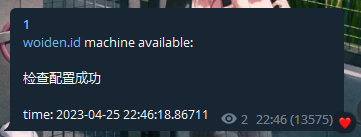
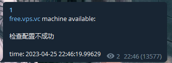

# haxcilent
A Crawler for hax/woiden/free.vps.vc run by GO 

- 在使用前请遍历一次文件并填对所有参数否则无法运行

## 必填参数
  
  网址
  
  telegrambot token
  
  chat id
  
  cookie(可选,仅需要PHPSESSID)
  
  都放置在go文件中较前位置

## TO USE
- 在使用前请遍历一次文件并填对所有参数否则无法运行
- 需要自行编译

Debian/Ubuntu
```
apt install git golang -y && git clone https://github.com/IsMio/haxcilent.git && cd haxclient
```
```
go build main.go
```
运行
```
chmod +x main 
```
```
./main
```
运行后请使用screen或pm2之类的保活程序

运行成功后会向通过telegrambot向你设置的对话发送消息

如下图



若出现



请检查你的host是否正确填入以及cookie是否过期

## TODO
- [ ] Docker support
- [ ] Linux shell
- [x] 三网站合1
- [ ] Docker support
- [ ] Linux shell
- [x] vps.vc support 
- [x] ~~优化了屎山（bushi~~

欢迎大神来完善与pr
